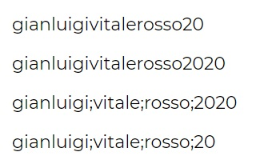

# Js-pwdgen-wannabe
The website asks the user: name, surname and favourite color and prints 4 texts on the page:
* namesurnamefavouritecolor20
* namesurnamefavouritecolor + current year
* name;surname;favouritecolor; + current year
* name;surname;favouritecolor; + (current year - 2000)
***
### [Live Website](https://gianluigivitale.github.io/js-pwdgen-wannabe/)
***
### Preview:

